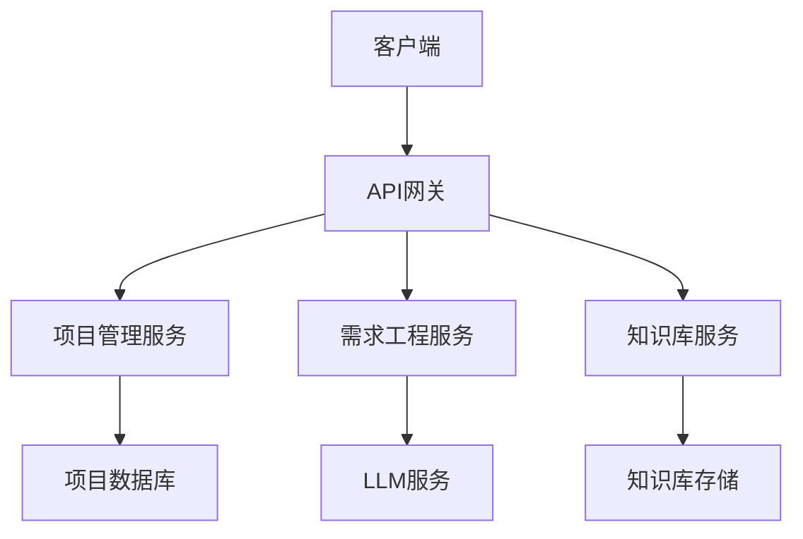
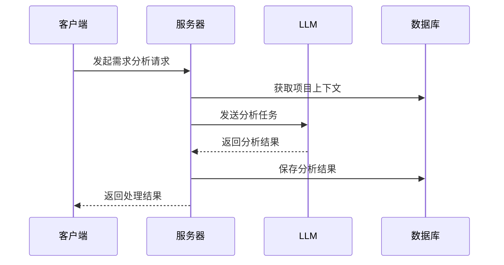

# 详细设计文档

## 1. 项目管理模块

### 1.1 数据模型
```python
class Project:
    id: str
    name: str
    description: str
    status: ProjectStatus
    created_at: datetime
    updated_at: datetime
    members: List[Member]
    settings: ProjectSettings

class Requirement:
    id: str
    project_id: str
    title: str
    description: str
    type: RequirementType
    priority: Priority
    status: RequirementStatus
    version: str
    created_at: datetime
    updated_at: datetime
    dependencies: List[str]
    tags: List[str]
```

### 1.2 核心接口
```python
class ProjectManager:
    async def create_project(self, project: Project) -> Project
    async def update_project(self, project: Project) -> Project
    async def delete_project(self, project_id: str) -> bool
    async def get_project(self, project_id: str) -> Project
    async def list_projects(self, filters: Dict) -> List[Project]
```

## 2. 需求工程引擎

### 2.1 需求澄清引擎
```python
class ClarificationEngine:
    async def start_session(self, project_id: str) -> Session
    async def process_input(self, session_id: str, input: str) -> Response
    async def get_clarifications(self, requirement_id: str) -> List[Clarification]
    async def end_session(self, session_id: str) -> Summary
```

### 2.2 需求分析引擎
```python
class AnalysisEngine:
    async def analyze_requirement(self, requirement: Requirement) -> Analysis
    async def identify_dependencies(self, requirement: Requirement) -> List[Dependency]
    async def assess_feasibility(self, requirement: Requirement) -> FeasibilityReport
    async def generate_metrics(self, requirement: Requirement) -> Metrics
```

### 2.3 质量评估引擎
```python
class QualityEngine:
    async def evaluate_requirement(self, requirement: Requirement) -> QualityReport
    async def check_completeness(self, requirement: Requirement) -> CompletenessReport
    async def check_consistency(self, requirement: Requirement) -> ConsistencyReport
    async def generate_quality_metrics(self, requirement: Requirement) -> QualityMetrics
```

### 2.4 文档生成引擎
```python
class DocumentEngine:
    async def generate_document(self, template: Template, data: Dict) -> Document
    async def export_document(self, document: Document, format: Format) -> bytes
    async def preview_document(self, document: Document) -> str
    async def batch_export(self, documents: List[Document], format: Format) -> List[bytes]
```

## 3. 知识库集成

### 3.1 知识库接口
```python
class KnowledgeBase:
    async def query(self, query: str, filters: Dict) -> List[KnowledgeItem]
    async def add_item(self, item: KnowledgeItem) -> bool
    async def update_item(self, item: KnowledgeItem) -> bool
    async def delete_item(self, item_id: str) -> bool
```

### 3.2 代码库接口
```python
class CodeBase:
    async def search_code(self, query: str, filters: Dict) -> List[CodeSnippet]
    async def get_documentation(self, item_id: str) -> Documentation
    async def get_examples(self, query: str) -> List[Example]
```

## 4. 提示词系统

### 4.1 提示词管理
```python
class PromptManager:
    async def get_prompt(self, context: Context) -> Prompt
    async def optimize_prompt(self, prompt: Prompt, feedback: Feedback) -> Prompt
    async def register_template(self, template: Template) -> bool
    async def update_template(self, template: Template) -> bool
```

### 4.2 上下文管理
```python
class ContextManager:
    async def create_context(self, session_id: str) -> Context
    async def update_context(self, context: Context, update: Dict) -> Context
    async def get_context(self, session_id: str) -> Context
    async def clear_context(self, session_id: str) -> bool
```

## 5. 工具集

### 5.1 验证工具
```python
class Validator:
    def validate_requirement(self, requirement: Requirement) -> ValidationResult
    def validate_project(self, project: Project) -> ValidationResult
    def validate_document(self, document: Document) -> ValidationResult
```

### 5.2 转换工具
```python
class Converter:
    def to_markdown(self, content: Any) -> str
    def to_html(self, content: Any) -> str
    def to_pdf(self, content: Any) -> bytes
    def to_docx(self, content: Any) -> bytes
```

### 5.3 可视化工具
```python
class Visualizer:
    def create_dependency_graph(self, requirements: List[Requirement]) -> Graph
    def create_progress_chart(self, project: Project) -> Chart
    def create_quality_dashboard(self, metrics: Metrics) -> Dashboard
```

## 6. 配置管理

### 6.1 系统配置
```toml
[system]
debug = false
log_level = "INFO"
max_concurrent_projects = 10

[llm]
provider = "deepseek"
model = "deepseek-chat"
temperature = 0.7
max_tokens = 2000

[storage]
type = "filesystem"
path = "./data"
backup_enabled = true
```

### 6.2 项目配置
```toml
[project]
name = "示例项目"
template = "standard"
language = "zh_CN"

[requirements]
naming_convention = "REQ-{project}-{number}"
version_format = "v{major}.{minor}"
status_flow = ["draft", "review", "approved", "implemented"]

[quality]
min_completeness_score = 0.8
min_consistency_score = 0.9
required_fields = ["description", "priority", "owner"]
```

## 7. 部署架构

### 7.1 组件部署


### 7.2 数据流

